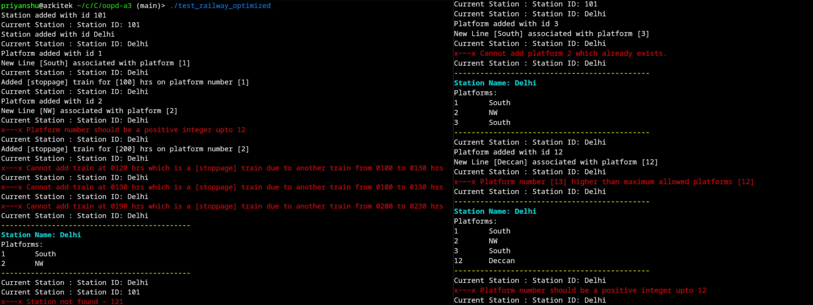

# oopd-a3

This project is an assignment for the OOPD course at IIITD.

## Instructions for running
- Running `make` or `make all` will compile both the versions of the program, i.e `debug` meant for debugging using -g flag and `optimized` compiled using O2 flag.
- Running `make clean` will clean up the executables.
- The file `test_railway.cpp` contains the source of the user test program.

## References

- [ANSI Escape Sequences](https://prirai.github.io/blogs/ansi-esc/)
- [Smart Pointers](https://en.cppreference.com/book/intro/smart_pointers)
- [Weak Pointer](https://en.cppreference.com/w/cpp/memory/weak_ptr )
- [fstream](https://cplusplus.com/reference/fstream/fstream)
- [vector](https://cplusplus.com/reference/vector/vector)
